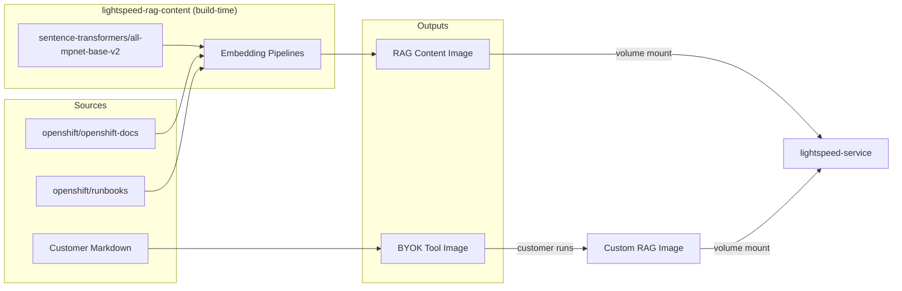
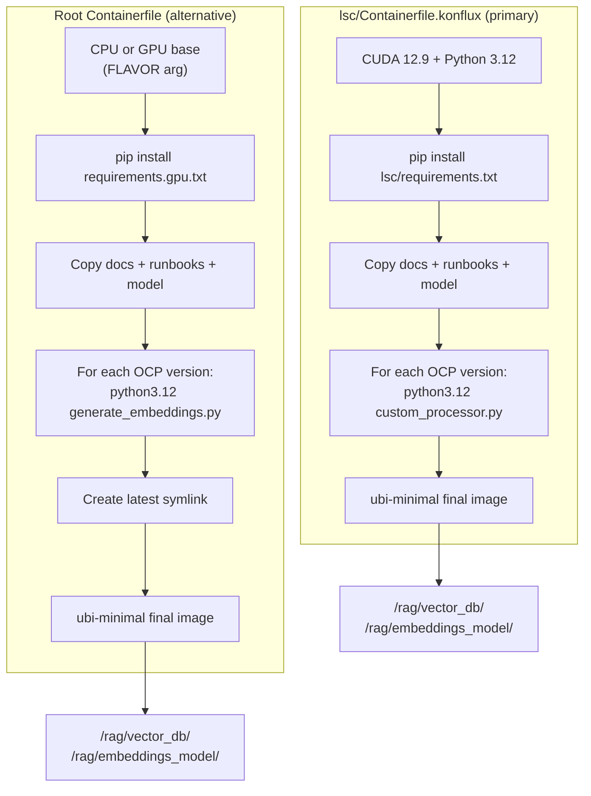
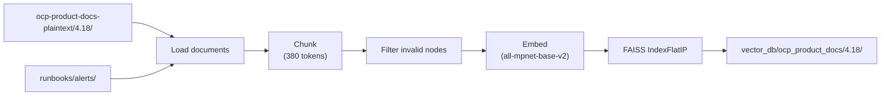

# Architecture

OpenShift LightSpeed RAG Content is a build-time artifact producer. It converts OpenShift product documentation and operational runbooks into pre-built FAISS vector indexes, packages them alongside a sentence-transformer embedding model into container images, and publishes those images for consumption by OpenShift LightSpeed (lightspeed-service) at runtime.

The project has no runtime component -- everything runs during the container image build.

## System Context



## Pipeline Implementations

Three pipeline implementations exist, each producing vector indexes from different input sources and using different processing strategies:


| Pipeline | Entry point | Backend | Used by CI | Python |
|----------|------------|---------|-----------|--------|
| **lsc library** | `lsc/custom_processor.py` | llamastack-faiss | `lightspeed-ocp-rag-push/pull-request` | 3.12 |
| **Plaintext** | `scripts/generate_embeddings.py` | LlamaIndex FAISS | `own-app-lightspeed-rag-content-push/pull-request` | 3.12 |
| **HTML** | `scripts/html_embeddings/generate_embeddings.py` | LlamaIndex FAISS | None | 3.12 |

## Container Build



Both builds follow the same pattern: a builder stage generates all vector indexes (one per OCP version), then a minimal final stage copies only the output artifacts. The final image contains the indexes at `/rag/vector_db/ocp_product_docs/{version}/` and the embedding model at `/rag/embeddings_model/`.

### Hermetic builds

For Konflux CI, builds run with `HERMETIC=true` (no network access). All dependencies are prefetched by Cachi2:

- **pip** packages from `requirements.{cpu,gpu}.txt` (with hashes)
- **RPMs** from `rpms.lock.yaml`
- **model.safetensors** from `artifacts.lock.yaml` (pinned URL + SHA256)

## Data Flow

A single OCP version goes through this flow during the container build:



Each chunk carries metadata (`docs_url`, `title`) derived from the file path during loading. The embedding model produces 768-dimensional normalized vectors stored in a FAISS inner-product index.

## Key Directories

```
lightspeed-rag-content/
├── lsc/                          # Installable Python library (primary pipeline)
│   ├── src/lightspeed_rag_content/   # Library source: DocumentProcessor, MetadataProcessor
│   ├── custom_processor.py           # Orchestrator for lsc pipeline
│   └── Containerfile.konflux         # Primary CI Containerfile
├── scripts/                      # Standalone pipeline scripts
│   ├── generate_embeddings.py        # Plaintext pipeline
│   ├── html_embeddings/              # HTML pipeline
│   └── html_chunking/                # Semantic HTML chunking library
├── byok/                         # Bring Your Own Knowledge tooling
├── ocp-product-docs-plaintext/   # Committed OCP docs (4.16 - 4.22)
├── runbooks/                     # Committed alert runbooks
├── embeddings_model/             # sentence-transformers/all-mpnet-base-v2
├── Containerfile                 # Alternative RAG content image
├── Makefile                      # Developer build automation
└── pyproject.toml                # PDM project metadata
```

## Integration with lightspeed-service

The RAG content image is mounted as a read-only volume by lightspeed-service (configured via the OpenShift LightSpeed operator's CRD). At startup, the service loads the FAISS indexes via LlamaIndex's `StorageContext.from_defaults()` and uses the same embedding model to encode user queries for vector similarity search.

**Critical invariant:** the embedding model used to build the indexes must be identical to the model the service uses for query embedding. A mismatch produces meaningless similarity scores. This is enforced by shipping the model inside the RAG content image.

## Key Decisions

- **Pre-built indexes, not runtime indexing.** All computation happens at build time. The service loads indexes read-only. This avoids runtime compute costs and ensures deterministic RAG content across deployments.

- **Multiple pipeline implementations coexist.** The lsc library pipeline (llamastack-faiss) is the primary CI path. The plaintext pipeline (LlamaIndex FAISS) is the alternative. The HTML pipeline is for development. This reflects an ongoing migration from plain LlamaIndex to llama-stack backends.

- **OCP docs and runbooks are committed to the repo.** The production build uses pre-committed content, not live clones. Content acquisition scripts exist for maintenance but are not invoked during the container build.

- **PDM with dual lockfiles.** CPU and GPU compute flavors have separate lockfiles (`pdm.lock.cpu`, `pdm.lock.gpu`) because PyTorch has different packages for each.
